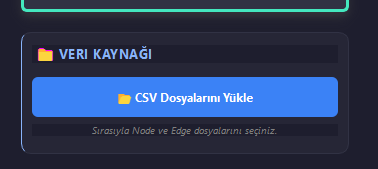

#  Yeni Özellik: Dosyadan Topoloji Yükleme

Projeye dışarıdan veri seti (CSV) yükleyerek topoloji oluşturma özelliği eklendi. Artık rastgele üretim yerine, hocanın verdiği veya kendi hazırladığımız veri setlerini kullanabiliriz.

## Nasıl Kullanılır?
1. Uygulamayı açın.
2. Sol menüdeki **"📂 CSV Dosyalarını Yükle"** butonuna tıklayın.
3. Açılan pencerede sırasıyla:
   - **1. Adım:** Düğümleri (Nodes) içeren CSV dosyasını seçin.
   - **2. Adım:** Kenarları (Edges/Links) içeren CSV dosyasını seçin.
4. Grafik otomatik olarak çizilecek ve değerler (Gecikme, Güvenilirlik vb.) güncellenecektir.

##  Gerekli CSV Formatı
Kodun doğru çalışması için CSV dosyaları **noktalı virgül (;)** ile ayrılmış olmalıdır.

### 1. Node (Düğüm) Dosyası Formatı
Sıralama: `Node ID; İşlem Gecikmesi; Güvenilirlik`
